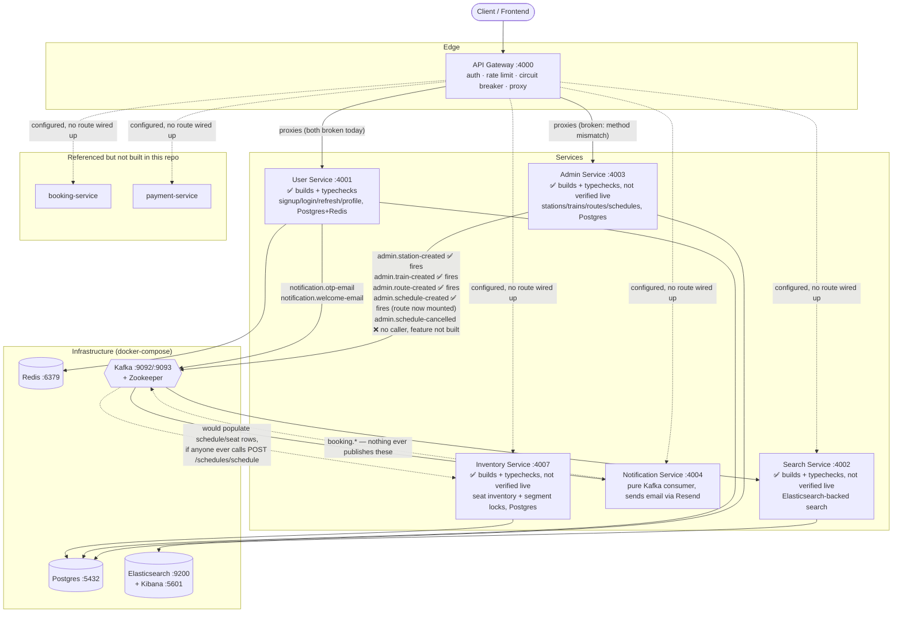

# IRCTC Backend — Implementation State

This document exists so a fresh Claude session (or a new engineer) can understand the
whole system without re-reading every file first. It describes **what is actually
built and how it actually behaves today** — not a roadmap, not a wishlist. Every claim
below was verified directly against source during a full-repo audit; where something
is broken, that's stated as a fact about current behavior, not flagged as a to-do.

For the exact HTTP/Kafka contract (methods, paths, request/response shapes, per-route
status), see [`api-contract.md`](./api-contract.md) in this same folder. This document
is the narrative map; that one is the reference table.

Per-service deep dives with pasted-in code also exist at `<service>/docs/README.md`
for admin-service, api-gateway, notification-service, and search-service (not
user-service — see below). Those are more detailed than this file for their one
service; this file is the only place that covers all five plus how they connect.

---

## 1. What this system is

IRCTC-backend is a train-ticket-booking backend split into independent services that
talk to each other over Kafka, sitting behind a single API gateway. The intended
shape is: users sign up and log in (user-service), admins create stations/trains/
routes/schedules (admin-service), those changes get indexed into Elasticsearch for
fast searching (search-service), and — not built yet — a booking flow would reserve
seats (inventory-service), take payment (payment-service), and confirm a booking
(booking-service), with notification-service emailing the user at each step.

**Only three of those six conceptual services exist in this repo**: admin-service,
user-service, and search-service, plus the always-present api-gateway and
notification-service. `booking-service`, `payment-service`, and `inventory-service`
are referenced by Kafka topic names, gateway config, and search-service's own event
types, but **no such directories or code exist anywhere in this repo**. Any topic
belonging to those (`inventory.seat-availability-updated`, `booking.*`,
`payment.*`) is a placeholder for future work, not a wired-up integration.

---

## 2. Services at a glance

| Service | Port | Purpose | Builds? | Runtime status |
|---|---|---|---|---|
| **api-gateway** | 4000 | Single entry point; JWT auth, rate limiting, circuit breakers, reverse-proxies to downstream services | ✅ Yes | Starts fine, but **every one of its 4 proxied routes is broken** (see §6) |
| **user-service** | 4001 | Signup (email+OTP), login, refresh-token rotation, user profile | ✅ Yes, `tsc --noEmit` passes clean | Auth routes still work as before; profile routes are now mounted (`updateProfile`/`deleteProfile` implemented, previously empty stubs that hung every request), `verifyOtp` no longer leaks the password hash, the welcome email is now sent, and a new internal-only user-lookup route exists for other services — see §5 and §6 |
| **search-service** | 4002 | Elasticsearch-backed train/station search, kept in sync via Kafka | ✅ Yes, `tsc --noEmit` passes clean | Code is complete and typechecks; **not verified live** (no reachable Elasticsearch/Kafka in this sandbox). The wrong-import build failure documented here previously was already stale by the time this was checked — the actual blockers were a bad controller import and three dead files referencing config fields that don't exist — see §5 and §6 |
| **admin-service** | 4003 | Staff-facing station/train/route/schedule management, publishes domain events | ✅ Yes, `tsc --noEmit` passes clean | Code is complete and typechecks; **not verified live** (no reachable Postgres/Kafka in this sandbox). All 4 routes now mount, `createRoute`'s inverted check and `createStation`'s missing `await` are fixed, `ROUTE_CREATED` now publishes, and every route is behind `getUserContext` — see §5 and §6 |
| **notification-service** | 4004 | Pure Kafka consumer — renders and sends transactional emails via Resend | ✅ Yes | Starts and runs correctly; only 2 of 5 email types it can send are ever actually triggered |
| **inventory-service** | 4007 | Per-schedule seat inventory: tracks available/locked/booked counts and individual seat state, supports segment (partial-journey) locking, kept in sync via Kafka from admin-service's schedule events | ✅ Yes, `tsc --noEmit` passes clean | Code is complete and typechecks; **not verified live** — this sandbox has no reachable Postgres/Kafka, so `npm run dev` and an actual HTTP/Kafka round-trip haven't been exercised. Blocked from ever actually receiving events in practice because `admin.schedule-created` never fires (see Tier 2 below) and no gateway route reaches it (see api-gateway row) |

`admin-service` previously had no `.env.example` of its own and, per §7, once had
a real (gitignored, uncommitted) `.env` that was byte-for-byte user-service's —
both now have proper, distinct `.env.example` files with the ports the Gateway
already assumed (`4003` for admin, `4001` for user).

---

## 3. Architecture

---

## 4. Infrastructure (`docker-compose.yml`)

| Container | Image | Ports | Used by |
|---|---|---|---|
| `postgres` | `postgres:15` | 5432 | admin-service, user-service (via Prisma) |
| `pgadmin` | `dpage/pgadmin4` | 8081 | Postgres admin UI |
| `redis` | `redis/redis-stack:6.2.6-v19` | 6379, 8001 | api-gateway (rate limiting), user-service (OTP/session/cache) |
| `zookeeper` | `confluentinc/cp-zookeeper:7.5.0` | 2181 | Kafka |
| `kafka` | `confluentinc/cp-kafka:7.5.0` | 9092 (internal), 9093 (host) | every service that produces/consumes events |
| `kafka-ui` | `provectuslabs/kafka-ui` | 8080 | Kafka inspection UI |
| `elasticsearch` | `elasticsearch:8.12.0` | 9200 | search-service |
| `kibana` | `kibana:8.12.0` | 5601 | Elasticsearch inspection UI |

None of the five application services themselves are containerized in
`docker-compose.yml` — only their infrastructure dependencies are. Each service is
run locally (`npm run dev`) against these containers.

Note the Kafka broker address split: some services' `.env` point at `localhost:9092`
(admin-service, user-service) and others at `localhost:9093` (search-service,
notification-service) — both are valid per the compose file's dual listener setup
(`9092` internal/container-network, `9093` host-mapped), so this isn't a bug, just
worth knowing if you're comparing `.env` files side by side and the port looks
inconsistent.

---

## 5. Per-service notes

### api-gateway
The only service every client request is meant to go through. Middleware order:
`cors → helmet → reqLogger → (conditional raw-body for a Razorpay webhook path that
has no route) → json/urlencoded → cookieParser → morgan (dev only) → /health →
/api/* → notFound → errorMiddleware`.

Auth is JWT-based: `requireAuth` reads `Authorization: Bearer <token>` or an
`accessToken` cookie, verifies it, and attaches `req.user = { id }` plus forwards
identity downstream via an `x-user-id` header (downstream services trust this header
rather than re-verifying the JWT themselves — see user-service's `getUserContext`).

Proxying goes through a hand-rolled circuit breaker (`CLOSED → OPEN → HALF_OPEN`,
threshold 5 failures, 60s reset) per downstream service. Seven breakers are
constructed (one per conceptual service) but only **two are ever exercised** —
`userService` and `adminService` — because those are the only two `createProxy(...)`
calls anywhere in the route table. The path-rewrite rule is simple and applies
uniformly: strip the first path segment after `/api`, forward the rest verbatim.
This simplicity is exactly why routes break — see §6.

### user-service
Owns identity: `User` table in Postgres (id, firstName, lastName, email, optional
password, emailVerified, timestamps — no roles/sessions table, no OAuth fields even
though `GOOGLE_CLIENT_ID`/`SECRET` are read into config and never used — deliberately
out of scope for this pass, see below). Sessions live entirely in Redis, not Postgres:

- `otp:session:<id>` — pending-signup metadata + HMAC'd OTP, TTL-bound
- `otp:rate:<email>` / `otp:attempt:<email>` — hourly request cap / verify-attempt cap
- `refresh:<userId>:<deviceId>` — current refresh-token JTI, one entry per device (a
  new login on a second device doesn't invalidate the first — they're keyed
  independently)
- `user:<userId>` — cached profile, read by `getUserProfile`

Access tokens are short-lived (15m), refresh tokens long-lived (7d), both delivered
as httpOnly/secure/sameSite=strict cookies, never in the JSON body. Refresh rotation
detects token reuse (a mismatched JTI triggers session revocation) — a real, working
security feature, not just a checkbox.

**Fixed this pass**: `user.route.ts` (profile routes) is now mounted at `/user` in
`server.ts` — it was fully written but never wired up before. `updateProfile` and
`deleteProfile` were empty `// TODO` stubs that hung every request (`asyncHandler`
never sends a response if the wrapped function doesn't); both are implemented now
(`updateProfile` only allows changing `firstName`/`lastName` — email and password
are deliberately excluded, those need their own verification-gated flows).
`verifyOtp` no longer returns the bcrypt password hash to the client — the service
layer now strips it, matching every other read path. `sendWelcomeEmail` is now
actually called from `verifyOtp` (fire-and-forget, log-only on failure) — the
producer method and the notification-service consumer were both already correct,
nothing had ever called the producer. `getUserProfile`'s cache-miss bug (returning
the unscrubbed row instead of the scrubbed copy it just cached) is fixed. A new
`GET /user/internal/:userId` route exists behind a shared-secret `internalAuth`
middleware (mirroring the pattern already built for inventory-service) — needed by
booking-service, built later, to resolve a user's profile without a JWT. A missing
`Express.Request.user` type augmentation (why `tsc --noEmit` used to fail) is added.
The unused Mongoose/MongoDB wiring (`config/db.ts`, imported in `index.ts` but never
called — the real datastore is Postgres) is deleted outright, along with a
`types/index.ts` carrying the same unrelated RAG/`KnowledgeDoc` dead code found in
admin-service. `INTERNAL_SERVICE_KEY` is no longer a dead config field — the new
internal route actually reads it now.

**Still dead, out of scope for this pass**: `SENDGRID_API_KEY`, `GOOGLE_CLIENT_ID/SECRET`,
`RESEND_API_KEY`, `MAIL_SEND`, `NODE_ENV` — read into config, never consumed anywhere
in this service.

**Not verified live** — fixed and typechecked (`tsc --noEmit` passes clean) in a
sandbox with no reachable Postgres/Redis/Kafka.

### admin-service
Owns the staff-facing catalog: Station, Train (+ Seats), Route (+ RouteStations,
one route per train, enforced by a unique constraint), Schedule (one per
`(trainId, departureDate)`). All four resources are modeled cleanly in Prisma.

`config/index.ts` was present but **empty**, and `index.ts`/every config
submodule imported a `config/db.ts` that never existed anywhere in the project —
this is what actually blocked the build (the root README's "two missing files"
framing was slightly imprecise: one file was missing, the other existed but
empty). Fixed by populating `config/index.ts` (same shape as inventory-service's:
`SERVICE_NAME`, `PORT` default 4003, `DATABASE_URL`, `ALLOWED_ORIGINS`,
`KAFKA_BROKER`, `KAFKA_CLIENT_ID`, `INTERNAL_SERVICE_KEY`) and dropping the dead
`config/db.ts` import from `index.ts` — Prisma's own `config/prisma.ts` already
owns the DB connection, no separate connect call was ever needed. Also fixed:
`createStation` now `await`s the service call and returns a correct
`"Station created successfully"` message (was `"OTP sent successfully"`);
`createRoute`'s existence check was inverted (`if (!existingRoute) throw
"already exists"` — fixed to `if (existingRoute) throw`, also fixing the
"existis" typo); `getTrainById` is now mounted as `GET /trains/train/:trainId`
with the controller's own `:trainId` param name (was `POST /trains/route/:id`);
`schedule.route.ts` is now mounted at `/schedules` in `server.ts`; the
`ROUTE_CREATED` publish (previously commented out) now fires after a route is
created; every route across all three routers is now behind `getUserContext`
(previously zero auth was wired up anywhere in this service); the dead
`types/index.ts` (RAG/`KnowledgeDoc` types unrelated to this service's domain,
imported `mongoose` for no reason) was deleted. `admin.schedule-cancelled` still
has no caller — no cancel-schedule feature (route/controller/service) exists,
and building one wasn't in scope for this pass.

This service is a pure Kafka **producer** — it has no consumer of its own anywhere
in `src/kafka/`. **Not verified live** — fixed and typechecked
(`tsc --noEmit` passes clean) in a sandbox with no reachable Postgres/Kafka, so
no actual HTTP request or Kafka publish has been exercised yet.

### search-service
The only service backed by Elasticsearch instead of Postgres. Two indices:
`stations` (edge-ngram autocomplete + completion suggester) and `trains` (a train
document with a nested `route` array and a `schedules` array — routes and schedules
are not separate ES indices even though `ROUTE_INDEX`/`SCHEDULE_INDEX` constants
exist for them). It's a pure Kafka **consumer** with a small HTTP surface bolted on
top.

The compile failure previously documented here (a singular/plural import mismatch,
a default/named export mismatch on `errorMiddleware`) was already stale — both had
apparently been fixed independently before this pass started. What actually blocked
the build: `search.controller.ts` imported `searchService` from a nonexistent
`../services/inventory.service` (should be `../services/search.service` — another
instance of the copy-paste pattern, since that file's whole top doc-comment was
also admin-service's schedule-controller comment, now removed), and three files
(`config/redis.ts`, `middlewares/auth.middleware.ts`,
`middlewares/rate-limiting.middleware.ts`) — the unused api-gateway-style
scaffolding previously described as merely "inert" — actually reference config
fields (`REDIS_URL`, `JWT_ACCESS_SECRET`, `RATE_LIMIT_MAX_REQUESTS`,
`RATE_LIMIT_WINDOW_MS`) that don't exist on this service's trimmed-down `Config`
type. Since nothing outside that three-file cluster imported any of them, and
`tsc` type-checks every file matched by `include` regardless of whether it's
actually imported, this dead code blocked the whole service from compiling even
though it was functionally inert. All three files were deleted (confirmed unused
first). Also fixed: `searchTrains` now returns its real search results instead of
a hardcoded message; `debugStations`/`debugTrains` now call `getAllStations`/
`getAllTrains` instead of both calling `autocompleteStation`; `indexStation` now
sets the `name` field on the document it writes; `indexStation`/`indexSchedule`/
`cancelSchedule`/`updateSeatAvailability` no longer swallow their own
Elasticsearch errors internally, so `withDLQ`'s retry-then-DLQ path can actually
trigger; a `notFound` 404 handler (previously written but never mounted) is now
registered before the error middleware.

**Not verified live** — fixed and typechecked (`tsc --noEmit` passes clean) in a
sandbox with no reachable Elasticsearch or Kafka broker.

### notification-service
The simplest service in the repo: no HTTP routes at all (not even its own health
check — `server.ts` registers zero routes; the Express app only exists so the
process has something listening). It subscribes to **every** topic in
`KAFKA_TOPICS` (`Object.values(KAFKA_TOPICS)`, not an explicit list), handles 5 of
them, and logs-and-drops everything else including its own DLQ topic. Email
delivery goes through Resend (not SendGrid, despite `SENDGRID_API_KEY` being read
into config) with a 3-attempt retry inside `email-service.ts`, separate from the
Kafka-level 3-retry-then-DLQ mechanism in `shared/utils/dlqHanlder.ts`.

### inventory-service
Owns per-schedule seat state: `ScheduleInventory` (one row per admin-service
schedule, aggregate available/locked/booked counters recomputed from actual seat
rows rather than trusted as a running total), `SeatInventory` (one row per physical
seat per schedule), `SeatSegmentLock` (partial-journey locks — two segments overlap
when `a.fromSeq < b.toSeq AND b.fromSeq < a.toSeq`), `RouteStop` (ordered station
list per schedule, for resolving a station to its sequence number), and
`IdempotencyRecord` (guards the Kafka consumer against reprocessing).

It's a pure Kafka **consumer** (`admin.schedule-created` → `initializeInventory`,
`admin.schedule-cancelled` → `cancelScheduleInventory`) with a small HTTP surface:
`GET /schedules/:id/availability` (public), `GET /schedules/:id/seats` (end user via
gateway, or booking-service via an internal shared-secret header), and
`POST /seats/{lock,unlock,confirm,cancel-booking}` (internal-only, for
booking-service's saga). A background job (`utils/lockExpiry.ts`) uses a Postgres
advisory lock for leader election so only one running instance releases expired
seat/segment locks on an interval, then republishes `inventory.seat-availability-updated`.

Seat mutations use row-level `FOR UPDATE NOWAIT` locks plus a `retryTransaction`
wrapper that retries on Postgres serialization/deadlock errors — deliberate
pessimistic concurrency control, no Redis involved (unlike booking-service's
distributed locks).

Two things worth flagging about how this service reached its current state: the
Prisma schema, the Kafka consumer's event types, and the service layer were found
mid-session having reverted to an earlier stub/scaffold state (matching
admin-service's schema and a copy-pasted admin-style controller) despite a more
complete implementation having existed moments earlier in the same working
session — the version described here is the restored/completed one, verified via
`tsc --noEmit` and `prisma generate` only. **This has not been run against a live
Postgres/Kafka** — no broker or database was reachable in the environment this was
built in, so the HTTP routes and Kafka consumer are untested beyond static
type-checking.

---

## 6. Why nothing currently works end-to-end

This is the priority-ranked list of what's actually blocking the system, synthesized
from a full audit of every service. See `api-contract.md` for the file:line-level
detail behind each line.

**Tier 1 — a service can't even start:**
- ~~admin-service never builds~~ **Fixed.** `config/index.ts` was present but
  empty and `index.ts` imported a `config/db.ts` that never existed anywhere in
  the project — populated the former, dropped the dead import to the latter
  (Prisma's own `config/prisma.ts` already owns the DB connection). See §5.
- ~~search-service never compiles~~ **Fixed.** The originally-documented cause
  (a singular/plural import mismatch, a default/named export mismatch) was
  already stale by the time this was checked — the real blockers were a
  controller importing from a nonexistent path and three dead scaffold files
  referencing config fields that don't exist. See §5.

**Tier 2 — a service builds and starts, but its main entry points are broken:**
- **Every gateway-proxied route is broken**, for three different reasons: (a)
  `POST /api/users/auth/login` forwards to `/auth/login`, but user-service actually
  mounts login at `/api/v1/auth/login` — the gateway's "strip one segment" rule
  can't reproduce that prefix; (b) `GET /api/users/user/profile` forwards to
  `/user/profile`, which now exists on user-service (`user.route.ts` is mounted at
  `/user` as of this pass — see §5), but that file only defines `POST`/`PUT`/`DELETE
  /profile`, no `GET`, so the method mismatch remains; (c) the two admin routes
  (`GET /api/admins/stations/station`, `GET /api/admins/trains/train`) are
  registered as `GET` at the gateway but admin-service only defines `POST` for
  those paths — a method mismatch, still unfixed on the gateway side (admin-service
  itself now builds and runs, see §5, but the gateway can't reach it correctly yet).
  All three are gateway-side fixes, not yet done.
- ~~user-service didn't typecheck~~ **Fixed** — `middlewares/user-context.middleware.ts`
  accesses `req.user`, but no `Express.Request` augmentation existed anywhere in the
  service to give `Request` a `user` field; added `types/express.d.ts`, matching the
  same fix already applied to admin-service and inventory-service.

**Tier 3 — real logic bugs that would misbehave once the above is fixed:**
- ~~`admin-service`'s `createRoute` had an inverted existence check~~ **Fixed** —
  was `if (!existingRoute) throw "already exists"` (blocking every train's *first*
  route), now `if (existingRoute) throw ConflictError(...)`.
- ~~`station.controller.createStation` didn't `await` the service call~~ **Fixed**
  — now awaited, and returns the correct `"Station created successfully"` message.
- ~~`admin-service`'s `getTrainById` was unreachable~~ **Fixed** — now mounted as
  `GET /trains/train/:trainId`, matching the controller's own param name.
- ~~`user-service`'s `verifyOtp` returned the newly-created user including the
  bcrypt password hash~~ **Fixed** — the service layer now strips `password`
  before returning, matching every other read path.
- ~~`user-service`'s `getUserProfile` returned the unscrubbed row on a cache
  miss~~ **Fixed** — now returns the same scrubbed copy it just cached instead
  of the raw row it just fetched.
- ~~`user-service`'s `updateProfile`/`deleteProfile` were empty `// TODO`
  stubs~~ **Fixed** — both implemented (`updateProfile` only allows
  `firstName`/`lastName`; `deleteProfile` deletes the row and clears the Redis
  cache entry), and `user.route.ts` is now mounted so they're reachable.
- ~~`search-service`'s `searchController.searchTrains` discarded its real search
  results~~ **Fixed** — now returns the actual result set instead of a
  hardcoded, copy-pasted `"Train created successfully"` message.
- ~~`search-service`'s `debugStations` and `debugTrains` both called
  `autocompleteStation`~~ **Fixed** — now call `getAllStations`/`getAllTrains`
  respectively, which exist for exactly this purpose.

**Tier 4 — Kafka plumbing gaps (nothing crashes, data just silently doesn't flow):**
- ~~`admin.route-created` never fired~~ **Fixed** — the publish call in
  `createRoute` was commented out (search-service's `trains` index could never be
  populated); now fires after a route is created (failure caught+logged, matching
  `createTrain`'s pattern, not re-thrown).
- ~~`admin.schedule-created` never fired in practice~~ **Fixed** — the publish call
  was always correct, but its only trigger (`POST /schedules/schedule`) was never
  mounted in admin-service's `server.ts`; it's mounted now, so calling that route
  should let inventory-service's consumer receive a real event and initialize a
  schedule's seat rows — unverified live, but no longer blocked at the admin-service
  end.
- `admin.schedule-cancelled` has no caller anywhere — the producer method exists,
  nothing invokes it, and there's no cancel-schedule route/controller/service at all.
- ~~`notification.welcome-email` was fully wired on both ends but never
  fired~~ **Fixed** — `verifyOtp` now calls `sendWelcomeEmail` right after
  account creation (fire-and-forget, log-only on failure).
- `booking.confirmed`/`booking.failed`/`booking.cancelled` can never fire — no
  `booking-service` exists in this repo to publish them. Even if one existed, the
  typed payload shapes notification-service expects have no `email` field, so the
  consumer would silently warn-and-skip rather than send anything.
- ~~search-service's own DLQ safety net didn't work~~ **Fixed** —
  `indexStation`/`indexSchedule`/`cancelSchedule`/`updateSeatAvailability` each
  caught their own Elasticsearch errors and logged them, so nothing ever
  propagated out to `withDLQ`; all four now let errors propagate, so the
  existing retry-then-DLQ mechanism can actually trigger on an Elasticsearch
  outage instead of silently dropping the write. (`indexTrainRoute` already
  didn't swallow its own errors, so it needed no change.)

---

## 7. Cross-cutting patterns worth knowing before touching this codebase

- **A copy-paste-comment pattern showed up in at least four places**, always the
  same shape: a new controller/route file is built by copying an unrelated existing
  one and adapting the logic, but not the comments above it. Confirmed instances
  (all cleaned up as part of fixing each service — see §5):
  `search-service/src/controllers/search.controller.ts` and
  `routes/search.routes.ts` had comments describing admin-service's
  schedule-creation feature, `POST /schedule`, `station.route.ts`/`train.routes.ts`
  mounting; `user-service/src/services/user.service.ts`'s `getUserProfile` had a
  docstring describing OTP-based registration, copied from `auth.service.ts`'s
  `sendOtp`. If you see a comment that doesn't match the code
  under it, check whether it was copied from somewhere else in the repo before
  assuming it's just stale.
- **`admin-service/.env` used to be user-service's `.env`, byte-for-byte** (same
  `PORT=4001`, same `KAFKA_CLIENT_ID=irctc-service`, same OTP/token/mail settings
  that only make sense for user-service) — this would have collided with
  user-service on port 4001 the moment admin-service's build was fixed. Neither
  service actually has a real `.env` checked in (both are gitignored), so this was
  never externally visible; a fresh `admin-service/.env.example` with its own
  `PORT=4003` and admin-appropriate values now exists to prevent reintroducing it.
- **The `docs/auth.md` file** that used to document user-service's auth flow in
  depth was intentionally removed as part of setting up this `docs/` folder — this
  file and `api-contract.md` are now the source of truth for that flow instead.
- **Unrelated dependencies are pinned in nearly every service's `package.json`**:
  `@langchain/cohere`, `@langchain/core`, `@langchain/groq`, `@langchain/openai`,
  `mongoose`, `resend` (used in notification-service, unused elsewhere), and
  `otp-generator` show up across admin-service, api-gateway, notification-service,
  search-service, and user-service, almost none of them imported by the service
  they sit in. All five services also share the same dangling
  `"seed": "tsx src/services/seed.ts"` npm script, pointing at a file that doesn't
  exist anywhere in the repo.
- **Two different Zod import styles coexist**, sometimes within the same service:
  `import { z } from "zod"` (most schema files) vs. `import { ZodError } from
  "zod/v4"` (every service's `zod.formatter.ts`). Not currently broken, just an
  inconsistency worth normalizing if anyone touches Zod version pinning.
- **`shared/utils/dlqHanlder.ts` is a real, misspelled filename** ("Hanlder", not
  "Handler") that every consuming service imports under its real, misspelled name.
  The file's own header comment describes the correctly-spelled path, which doesn't
  match its own filename.
- **Downstream services trust an `x-user-id` header instead of re-verifying JWTs.**
  This only works if every request truly comes through the gateway's `requireAuth`
  first. Since the gateway's own proxied routes are currently all broken (§6),
  this trust boundary has never been exercised end-to-end in practice — worth
  re-checking once the routing bugs are fixed, to confirm nothing downstream can be
  reached by forging that header directly against a service's own port.
- **`dotenv.config()` runs too late in every service's `index.ts` that follows this
  pattern** (confirmed in user-service and inventory-service; worth checking the
  rest): the file's own top-level imports (`./server`, which transitively imports
  `./config`) execute before `dotenv.config()` is ever called on the line below
  them, so `config/index.ts`'s `process.env.*` reads see an environment that
  hasn't had `.env` loaded into it yet. Every value silently falls back to its
  hardcoded default (`PORT`, `DATABASE_URL`, `KAFKA_BROKER`, etc.) unless those
  variables happen to already be set in the real OS environment. Fixed in
  inventory-service by moving `dotenv.config()` to the first line of `index.ts`,
  before any other import.
- **A service's own `shared/`-style dependency can be uninstalled even when the
  service itself is** — `shared/` is its own npm package (own `package.json` +
  lockfile) separate from every service's `node_modules`, and its `kafkajs`
  dependency needs `npm ci` run inside `shared/` itself, not just inside whichever
  service imports `shared/utils/dlqHanlder.ts`. Without that, every consuming
  service's `tsc --noEmit` fails with `Cannot find module 'kafkajs'` on that one
  shared file, which reads as a code bug but is actually a missed install step.

---

## 8. Where to look next

- Exact request/response contract for every route and Kafka topic across all
  services: [`api-contract.md`](./api-contract.md).
- Deep, code-pasted walkthroughs for admin-service, api-gateway,
  notification-service, search-service, and inventory-service: `<service>/docs/README.md`.
- Root-level system map and cross-service flow diagrams: `/readme.md`.
- Standing punch list: `/missing.md`.
