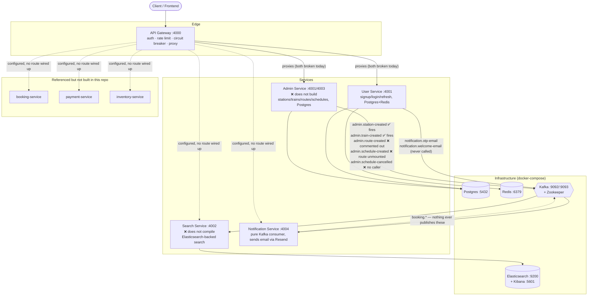

# IRCTC Backend — Implementation State

This document exists so a fresh Claude session (or a new engineer) can understand the
whole system without re-reading every file first. It describes **what is actually
built and how it actually behaves today** — not a roadmap, not a wishlist. Every claim
below was verified directly against source during a full-repo audit; where something
is broken, that's stated as a fact about current behavior, not flagged as a to-do.

For the exact HTTP/Kafka contract (methods, paths, request/response shapes, per-route
status), see [`api-contract.md`](./api-contract.md) in this same folder. This document
is the narrative map; that one is the reference table.

Per-service deep dives with pasted-in code also exist at `<service>/docs/README.md`
for admin-service, api-gateway, notification-service, and search-service (not
user-service — see below). Those are more detailed than this file for their one
service; this file is the only place that covers all five plus how they connect.

---

## 1. What this system is

IRCTC-backend is a train-ticket-booking backend split into independent services that
talk to each other over Kafka, sitting behind a single API gateway. The intended
shape is: users sign up and log in (user-service), admins create stations/trains/
routes/schedules (admin-service), those changes get indexed into Elasticsearch for
fast searching (search-service), and — not built yet — a booking flow would reserve
seats (inventory-service), take payment (payment-service), and confirm a booking
(booking-service), with notification-service emailing the user at each step.

**Only three of those six conceptual services exist in this repo**: admin-service,
user-service, and search-service, plus the always-present api-gateway and
notification-service. `booking-service`, `payment-service`, and `inventory-service`
are referenced by Kafka topic names, gateway config, and search-service's own event
types, but **no such directories or code exist anywhere in this repo**. Any topic
belonging to those (`inventory.seat-availability-updated`, `booking.*`,
`payment.*`) is a placeholder for future work, not a wired-up integration.

---

## 2. Services at a glance

| Service | Port | Purpose | Builds? | Runtime status |
|---|---|---|---|---|
| **api-gateway** | 4000 | Single entry point; JWT auth, rate limiting, circuit breakers, reverse-proxies to downstream services | ✅ Yes | Starts fine, but **every one of its 4 proxied routes is broken** (see §6) |
| **user-service** | 4001 | Signup (email+OTP), login, refresh-token rotation, user profile | ✅ Yes, but **fails `tsc --noEmit`** (see §6) | Starts and serves auth routes correctly; profile routes exist in code but are never mounted |
| **search-service** | 4002 | Elasticsearch-backed train/station search, kept in sync via Kafka | ❌ **No** — two independent compile errors in `index.ts` | Cannot start at all as checked in |
| **admin-service** | 4001 (`.env`) / 4003 (assumed by gateway) | Staff-facing station/train/route/schedule management, publishes domain events | ❌ **No** — `src/index.ts` imports `./config` and `./config/db`, neither of which exists anywhere in the project | Cannot start at all — nothing downstream of it can be exercised through a real HTTP call |
| **notification-service** | 4004 | Pure Kafka consumer — renders and sends transactional emails via Resend | ✅ Yes | Starts and runs correctly; only 2 of 5 email types it can send are ever actually triggered |

`admin-service`'s and `admin/user-service`'s `.env` PORT values collide (see §7,
"admin-service's `.env` is user-service's `.env`") — this is one of several reasons
admin-service's actual intended port is unclear even setting the build failure aside.

---

## 3. Architecture

---

## 4. Infrastructure (`docker-compose.yml`)

| Container | Image | Ports | Used by |
|---|---|---|---|
| `postgres` | `postgres:15` | 5432 | admin-service, user-service (via Prisma) |
| `pgadmin` | `dpage/pgadmin4` | 8081 | Postgres admin UI |
| `redis` | `redis/redis-stack:6.2.6-v19` | 6379, 8001 | api-gateway (rate limiting), user-service (OTP/session/cache) |
| `zookeeper` | `confluentinc/cp-zookeeper:7.5.0` | 2181 | Kafka |
| `kafka` | `confluentinc/cp-kafka:7.5.0` | 9092 (internal), 9093 (host) | every service that produces/consumes events |
| `kafka-ui` | `provectuslabs/kafka-ui` | 8080 | Kafka inspection UI |
| `elasticsearch` | `elasticsearch:8.12.0` | 9200 | search-service |
| `kibana` | `kibana:8.12.0` | 5601 | Elasticsearch inspection UI |

None of the five application services themselves are containerized in
`docker-compose.yml` — only their infrastructure dependencies are. Each service is
run locally (`npm run dev`) against these containers.

Note the Kafka broker address split: some services' `.env` point at `localhost:9092`
(admin-service, user-service) and others at `localhost:9093` (search-service,
notification-service) — both are valid per the compose file's dual listener setup
(`9092` internal/container-network, `9093` host-mapped), so this isn't a bug, just
worth knowing if you're comparing `.env` files side by side and the port looks
inconsistent.

---

## 5. Per-service notes

### api-gateway
The only service every client request is meant to go through. Middleware order:
`cors → helmet → reqLogger → (conditional raw-body for a Razorpay webhook path that
has no route) → json/urlencoded → cookieParser → morgan (dev only) → /health →
/api/* → notFound → errorMiddleware`.

Auth is JWT-based: `requireAuth` reads `Authorization: Bearer <token>` or an
`accessToken` cookie, verifies it, and attaches `req.user = { id }` plus forwards
identity downstream via an `x-user-id` header (downstream services trust this header
rather than re-verifying the JWT themselves — see user-service's `getUserContext`).

Proxying goes through a hand-rolled circuit breaker (`CLOSED → OPEN → HALF_OPEN`,
threshold 5 failures, 60s reset) per downstream service. Seven breakers are
constructed (one per conceptual service) but only **two are ever exercised** —
`userService` and `adminService` — because those are the only two `createProxy(...)`
calls anywhere in the route table. The path-rewrite rule is simple and applies
uniformly: strip the first path segment after `/api`, forward the rest verbatim.
This simplicity is exactly why routes break — see §6.

### user-service
Owns identity: `User` table in Postgres (id, firstName, lastName, email, optional
password, emailVerified, timestamps — no roles/sessions table, no OAuth fields even
though `GOOGLE_CLIENT_ID`/`SECRET` are read into config and never used). Sessions
live entirely in Redis, not Postgres:

- `otp:session:<id>` — pending-signup metadata + HMAC'd OTP, TTL-bound
- `otp:rate:<email>` / `otp:attempt:<email>` — hourly request cap / verify-attempt cap
- `refresh:<userId>:<deviceId>` — current refresh-token JTI, one entry per device (a
  new login on a second device doesn't invalidate the first — they're keyed
  independently)
- `user:<userId>` — cached profile, read by `getUserProfile`

Access tokens are short-lived (15m), refresh tokens long-lived (7d), both delivered
as httpOnly/secure/sameSite=strict cookies, never in the JSON body. Refresh rotation
detects token reuse (a mismatched JTI triggers session revocation) — a real, working
security feature, not just a checkbox.

The service also drags in unused Mongoose/MongoDB wiring (`config/db.ts`, imported
in `index.ts`, never actually needed — the real datastore is Postgres) and a set of
config fields that are read but never consumed anywhere (`SENDGRID_API_KEY`,
`GOOGLE_CLIENT_ID/SECRET`, `INTERNAL_SERVICE_KEY`, `RESEND_API_KEY`, `MAIL_SEND`,
`NODE_ENV`) — see api-contract.md's Known Issues for the full list and why each is
dead.

### admin-service
Owns the staff-facing catalog: Station, Train (+ Seats), Route (+ RouteStations,
one route per train, enforced by a unique constraint), Schedule (one per
`(trainId, departureDate)`). All four resources are modeled cleanly in Prisma; the
problem is entirely in the application layer sitting on top, and in one missing
directory of files (see §6).

This service is a pure Kafka **producer** — it has no consumer of its own anywhere
in `src/kafka/`.

### search-service
The only service backed by Elasticsearch instead of Postgres. Two indices:
`stations` (edge-ngram autocomplete + completion suggester) and `trains` (a train
document with a nested `route` array and a `schedules` array — routes and schedules
are not separate ES indices even though `ROUTE_INDEX`/`SCHEDULE_INDEX` constants
exist for them). It's a pure Kafka **consumer** with a small HTTP surface bolted on
top (recently added — see api-contract.md and §6).

The service also still carries a large chunk of unused api-gateway-style scaffolding
(JWT auth middleware, Redis-backed rate limiting, a Redis client) that predates the
Elasticsearch rewrite and doesn't compile against this service's trimmed-down
`Config` type — none of it is imported by `index.ts`, so it's inert rather than
actively broken, but it's dead weight worth knowing about if you're grepping this
service for "how does auth work here" (answer: it doesn't, that code is a leftover).

### notification-service
The simplest service in the repo: no HTTP routes at all (not even its own health
check — `server.ts` registers zero routes; the Express app only exists so the
process has something listening). It subscribes to **every** topic in
`KAFKA_TOPICS` (`Object.values(KAFKA_TOPICS)`, not an explicit list), handles 5 of
them, and logs-and-drops everything else including its own DLQ topic. Email
delivery goes through Resend (not SendGrid, despite `SENDGRID_API_KEY` being read
into config) with a 3-attempt retry inside `email-service.ts`, separate from the
Kafka-level 3-retry-then-DLQ mechanism in `shared/utils/dlqHanlder.ts`.

---

## 6. Why nothing currently works end-to-end

This is the priority-ranked list of what's actually blocking the system, synthesized
from a full audit of every service. See `api-contract.md` for the file:line-level
detail behind each line.

**Tier 1 — a service can't even start:**
- **admin-service never builds.** `src/index.ts` imports `./config` and
  `./config/db`; every other file under `src/` that needs config imports it too
  (logger, prisma client, kafka client, cors middleware) — neither file exists
  anywhere in the project. Nothing that depends on admin-service being reachable
  (station/train/route/schedule creation, and by extension most of search-service's
  and the gateway's admin routes) can be exercised through a real request.
- **search-service never compiles.** `src/index.ts` imports `./routes/search.route`
  (singular) — the actual file, added later, is `routes/search.routes.ts` (plural),
  so the import still doesn't resolve — plus it default-imports `errorHandler` from
  `error.middleware.ts`, which only has a named export.

**Tier 2 — a service builds and starts, but its main entry points are broken:**
- **Every gateway-proxied route is broken**, for three different reasons: (a)
  `POST /api/users/auth/login` forwards to `/auth/login`, but user-service actually
  mounts login at `/api/v1/auth/login` — the gateway's "strip one segment" rule
  can't reproduce that prefix; (b) `GET /api/users/user/profile` forwards to a route
  that doesn't exist on user-service at all (`user.route.ts` is never mounted in
  `server.ts`), and even if it were, that file only defines `POST`/`PUT`/`DELETE
  /profile`, no `GET`; (c) the two admin routes
  (`GET /api/admins/stations/station`, `GET /api/admins/trains/train`) are
  registered as `GET` at the gateway but admin-service only defines `POST` for
  those paths — a method mismatch, independent of admin-service's build failure.
- **user-service doesn't typecheck.** `middlewares/user-context.middleware.ts`
  accesses `req.user`, but no `Express.Request` augmentation exists anywhere in the
  service to give `Request` a `user` field — `npx tsc --noEmit` fails.

**Tier 3 — real logic bugs that would misbehave once the above is fixed:**
- `admin-service`'s `createRoute` has an inverted existence check
  (`train.service.ts`) — a train can never get its *first* route created; the error
  path meant for "route already exists" fires exactly when no route exists yet.
- `station.controller.createStation` doesn't `await` the service call — the 200
  response fires before the DB write settles, and any `ConflictError` becomes an
  unhandled promise rejection instead of a 409.
- `admin-service`'s `getTrainById` is unreachable by design: mounted `POST
  /trains/route/:id` (route param named `:id`), but the controller reads
  `req.params.trainId` — always `undefined`, always 400s.
- `user-service`'s `verifyOtp` returns the newly-created user **including the bcrypt
  password hash** in the response body — every other read path in this service
  strips `password` first, this one doesn't.
- `user-service`'s `getUserProfile` strips the password before caching to Redis, but
  on a cache miss it accidentally **returns the unscrubbed row it just fetched**,
  not the scrubbed copy it just cached — so a cold cache leaks the hash, a warm one
  doesn't.
- `user-service`'s `updateProfile`/`deleteProfile` are empty `// TODO` stubs that
  never send a response — calling either (once `user.route.ts` is mounted) hangs the
  request until the client times out.
- `search-service`'s `searchController.searchTrains` computes real search results
  and then discards them, responding with a hardcoded, copy-pasted
  `"Train created successfully"` message instead.
- `search-service`'s `debugStations` and `debugTrains` handlers are both wired to
  call `autocompleteStation` — a copy-paste bug; they should call `getAllStations`/
  `getAllTrains` respectively, which exist for exactly this purpose.

**Tier 4 — Kafka plumbing gaps (nothing crashes, data just silently doesn't flow):**
- `admin.route-created` never fires — the publish call in `createRoute` is
  commented out. This means search-service's `trains` index can never be
  populated, independent of anything in search-service itself.
- `admin.schedule-created` never fires in practice — the publish call is correct,
  but its only trigger (`POST /schedule`) is never mounted in admin-service's
  `server.ts`.
- `admin.schedule-cancelled` has no caller anywhere — the producer method exists,
  nothing invokes it, and there's no cancel-schedule route/controller/service at all.
- `notification.welcome-email` is fully wired on both ends (producer method exists
  in user-service, consumer handles it correctly in notification-service) but
  **nothing ever calls the producer method** — the natural call site
  (`verifyOtp`, right after account creation) doesn't call it.
- `booking.confirmed`/`booking.failed`/`booking.cancelled` can never fire — no
  `booking-service` exists in this repo to publish them. Even if one existed, the
  typed payload shapes notification-service expects have no `email` field, so the
  consumer would silently warn-and-skip rather than send anything.
- search-service's own DLQ safety net doesn't work: every index-operation function
  catches its own Elasticsearch errors and logs them, so nothing ever propagates
  out to `withDLQ` — an Elasticsearch outage silently drops writes instead of
  landing on `dlq.search-service`.

---

## 7. Cross-cutting patterns worth knowing before touching this codebase

- **A copy-paste-comment pattern shows up in at least three places**, always the
  same shape: a new controller/route file is built by copying an unrelated existing
  one and adapting the logic, but not the comments above it. Confirmed instances:
  `search-service/src/controllers/search.controller.ts` and
  `routes/search.routes.ts` (comments describe admin-service's schedule-creation
  feature, `POST /schedule`, `station.route.ts`/`train.routes.ts` mounting — none of
  which is true of search-service), and `user-service/src/services/user.service.ts`'s
  `getUserProfile` (docstring describes OTP-based registration, copied from
  `auth.service.ts`'s `sendOtp`). If you see a comment that doesn't match the code
  under it, check whether it was copied from somewhere else in the repo before
  assuming it's just stale.
- **`admin-service/.env` is user-service's `.env`.** Byte-for-byte, both files share
  the same `PORT=4001`, the same `KAFKA_CLIENT_ID=irctc-service`, the same
  `ALLOWED_ORIGINS`, and the same OTP/token/mail settings — values that only make
  sense for user-service (OTP config, token expiry) have no reason to exist in
  admin-service's env at all. If admin-service's build is ever fixed, starting it
  with this `.env` as-is would try to bind port 4001, colliding with user-service.
- **The `docs/auth.md` file** that used to document user-service's auth flow in
  depth was intentionally removed as part of setting up this `docs/` folder — this
  file and `api-contract.md` are now the source of truth for that flow instead.
- **Unrelated dependencies are pinned in nearly every service's `package.json`**:
  `@langchain/cohere`, `@langchain/core`, `@langchain/groq`, `@langchain/openai`,
  `mongoose`, `resend` (used in notification-service, unused elsewhere), and
  `otp-generator` show up across admin-service, api-gateway, notification-service,
  search-service, and user-service, almost none of them imported by the service
  they sit in. All five services also share the same dangling
  `"seed": "tsx src/services/seed.ts"` npm script, pointing at a file that doesn't
  exist anywhere in the repo.
- **Two different Zod import styles coexist**, sometimes within the same service:
  `import { z } from "zod"` (most schema files) vs. `import { ZodError } from
  "zod/v4"` (every service's `zod.formatter.ts`). Not currently broken, just an
  inconsistency worth normalizing if anyone touches Zod version pinning.
- **`shared/utils/dlqHanlder.ts` is a real, misspelled filename** ("Hanlder", not
  "Handler") that every consuming service imports under its real, misspelled name.
  The file's own header comment describes the correctly-spelled path, which doesn't
  match its own filename.
- **Downstream services trust an `x-user-id` header instead of re-verifying JWTs.**
  This only works if every request truly comes through the gateway's `requireAuth`
  first. Since the gateway's own proxied routes are currently all broken (§6),
  this trust boundary has never been exercised end-to-end in practice — worth
  re-checking once the routing bugs are fixed, to confirm nothing downstream can be
  reached by forging that header directly against a service's own port.

---

## 8. Where to look next

- Exact request/response contract for every route and Kafka topic across all five
  services: [`api-contract.md`](./api-contract.md).
- Deep, code-pasted walkthroughs for admin-service, api-gateway,
  notification-service, and search-service: `<service>/docs/README.md`.
- Root-level system map and cross-service flow diagrams: `/readme.md`.
- Standing punch list (may be slightly behind this document, since it predates the
  discovery of the api-gateway admin-route bug and search-service's new controller
  bugs in §6): `/missing.md`.
