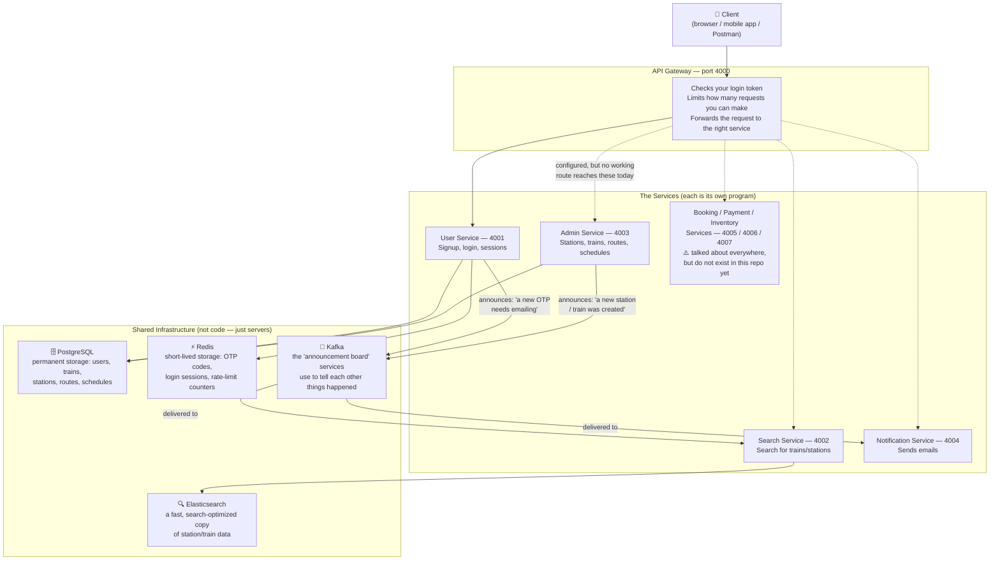
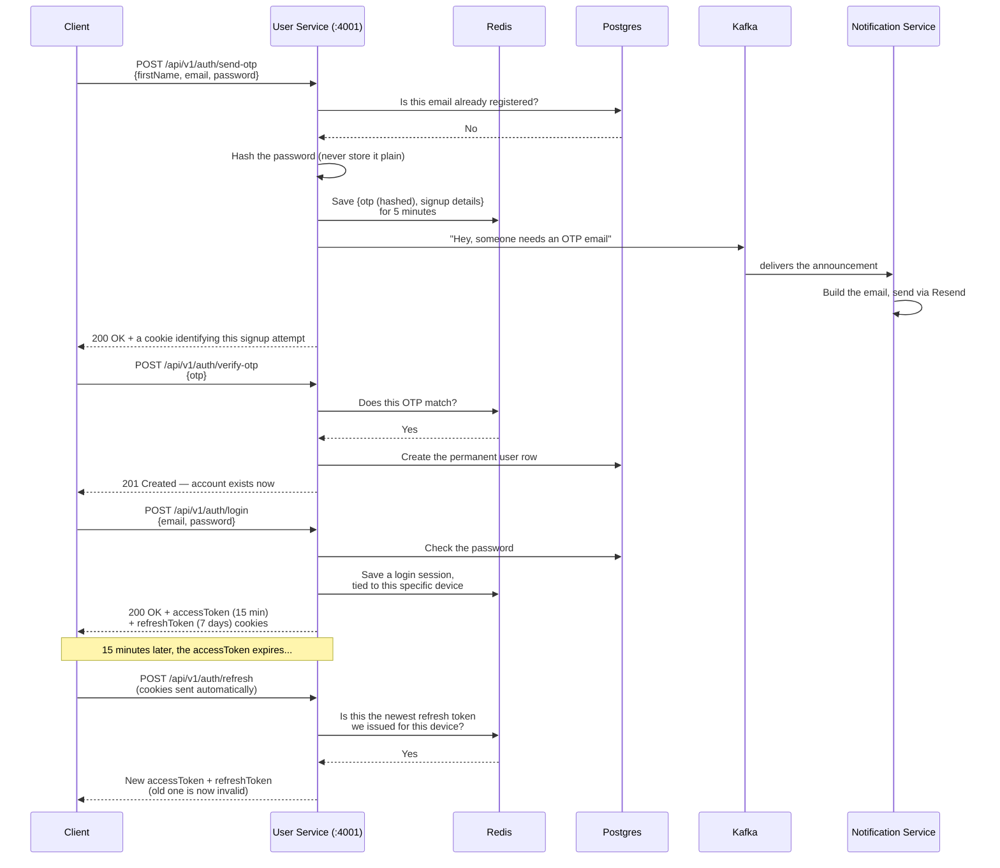
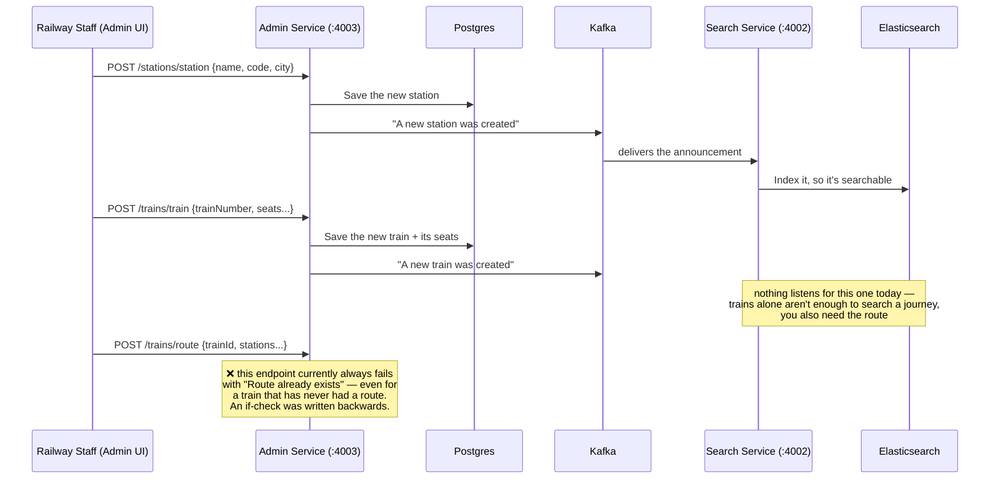
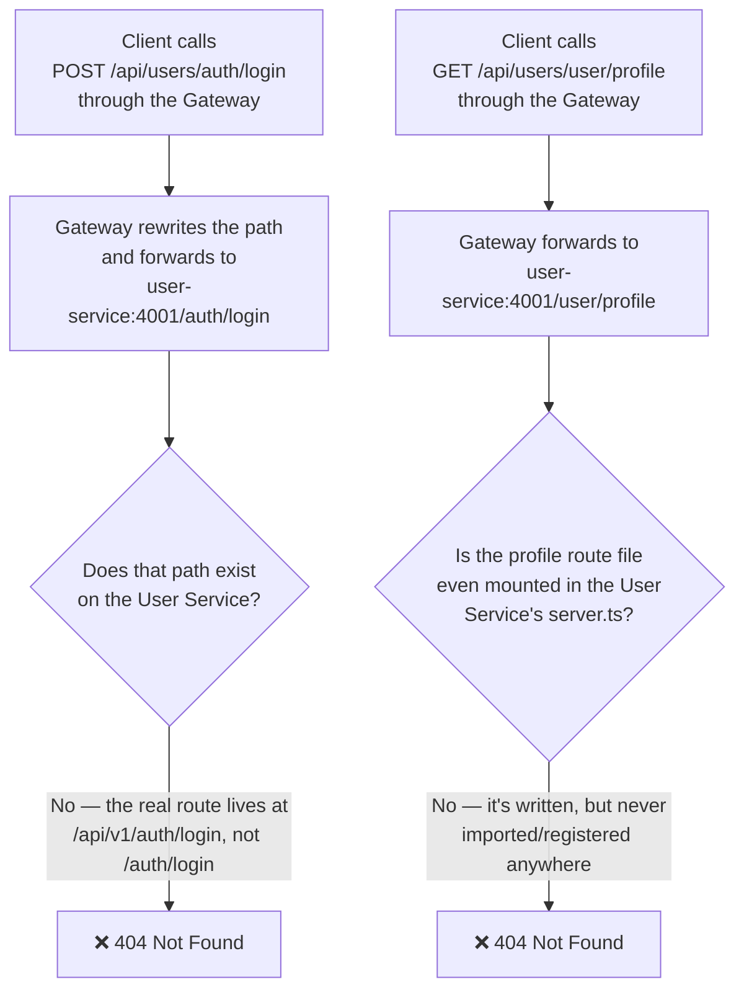
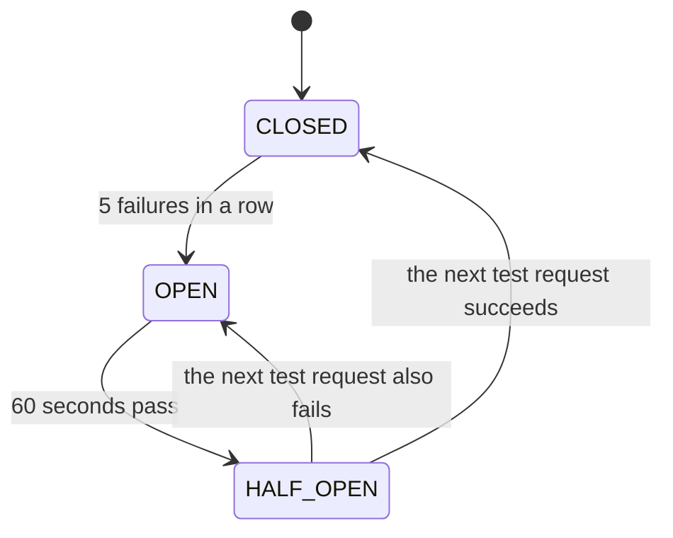
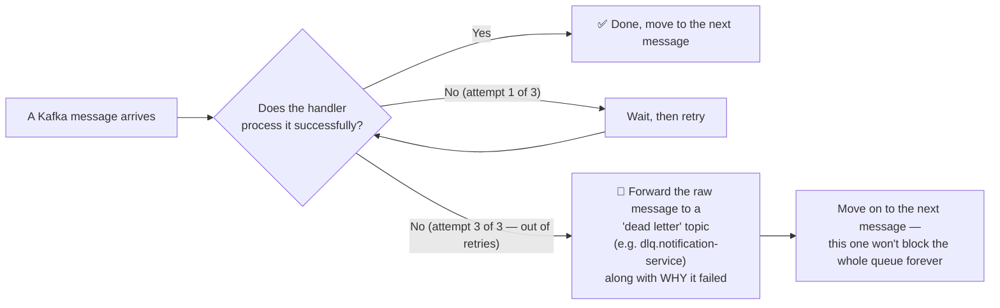
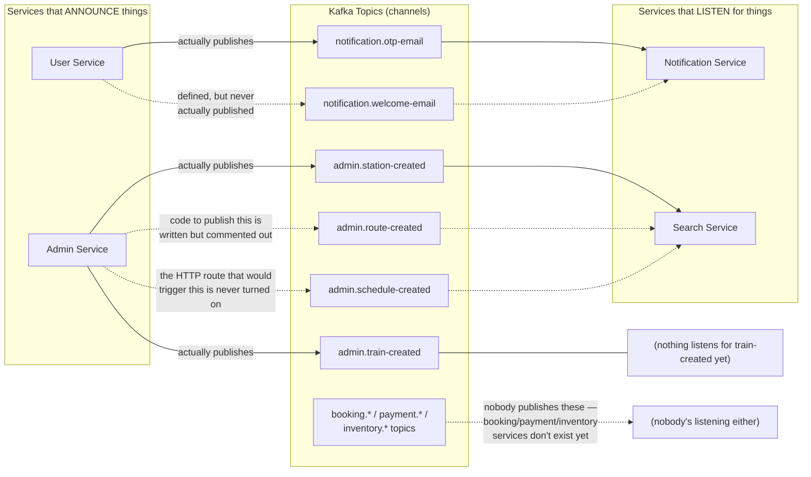

# IRCTC Backend — How This Whole Thing Works

This is a from-scratch clone of an IRCTC-style train ticketing backend, built as
**microservices** instead of one big application.

> **Microservice, in one sentence:** instead of one giant program that does
> everything (sign people up, manage trains, search, send emails...), the work
> is split into several small, independent programs that each do _one_ job and
> talk to each other over the network. If one of them crashes, the others can
> often keep running.

This document is the map. It won't teach you how every line of code works —
each service has its own deep-dive doc for that (linked at the bottom) — but
after reading this, you should understand **what exists, how the pieces are
supposed to fit together, and what actually works today versus what's still
broken or unbuilt.**

---

## 1. The Big Picture



**Read this diagram as:** a client only ever talks to the **API Gateway**.
The Gateway is supposed to be the single front door that forwards requests to
whichever service actually knows how to handle them. Services almost never
call each other directly over HTTP — when one service needs to tell another
"something happened," it posts an announcement to **Kafka**, and whichever
services care about that announcement pick it up on their own time. This is
called **event-driven communication**, and it's why a service being slow or
down doesn't necessarily stop the others from working.

The dotted arrows above are deliberate — they mean "this connection is wired
up in config, but nothing actually flows through it successfully yet." More
on exactly where and why in section 6.

---

## 2. Meet the Services

| Service                                    | Port               | What it's _for_, in plain words                                                                                                                                                                        | Right now                                                                                           |
| ------------------------------------------ | ------------------ | ------------------------------------------------------------------------------------------------------------------------------------------------------------------------------------------------------ | --------------------------------------------------------------------------------------------------- |
| **API Gateway**                            | 4000               | The receptionist. Every request from the outside world is supposed to knock here first — it checks your login token, makes sure you're not spamming the server, and forwards you to the right service. | ✅ Runs, but only 2 routes are wired up, and both are currently broken (see §6)                     |
| **User Service**                           | 4001               | Handles "who are you." Signup (with an email OTP), login, and issuing/renewing the tokens that prove you're logged in.                                                                                 | ✅ The auth part works well and is thoroughly tested/documented. Profile editing is unbuilt.        |
| **Admin Service**                          | 4003               | The back office. Where railway staff would add new stations, trains, the route a train follows, and which dates it runs.                                                                               | ❌ Currently fails to even start — two files it needs are missing                                   |
| **Search Service**                         | 4002               | The "find a train" feature, backed by Elasticsearch instead of the regular database, for fast searching.                                                                                               | ❌ Currently fails to even start — a route file it needs is missing                                 |
| **Notification Service**                   | 4004               | A background worker with no real webpage of its own. It just listens for "someone needs an email" announcements on Kafka and sends them.                                                               | ✅ Runs correctly as designed                                                                       |
| **Booking / Payment / Inventory Services** | 4005 / 4006 / 4007 | Would handle seat booking, payments, and live seat availability.                                                                                                                                       | ❌ Don't exist in this repository — only their _names_ and Kafka topics are reserved for the future |

Everything is written in **TypeScript** with **Express** (a web framework),
and each service is its own standalone program with its own `package.json` —
there's no single command that starts "the app"; you start each service you
want to run separately (see §8).

---

## 3. Jargon Buster

A short glossary for anything above (or below) that might be unfamiliar:

| Term                        | What it actually means here                                                                                                                                                                                                    |
| --------------------------- | ------------------------------------------------------------------------------------------------------------------------------------------------------------------------------------------------------------------------------ |
| **JWT** (JSON Web Token)    | A signed, tamper-proof string that proves "this is user #123" without the server needing to look anything up. Used for login sessions.                                                                                         |
| **OTP**                     | One-Time Password — the 6-digit code emailed to you during signup, valid for a few minutes.                                                                                                                                    |
| **Kafka / "topic"**         | Kafka is a message board. A "topic" is one named channel on that board (e.g. `admin.station-created`). Services **publish** messages to a topic, and other services **subscribe** to read them.                                |
| **DLQ** (Dead-Letter Queue) | If a service tries to process a Kafka message and keeps failing (e.g. 3 times), it gives up, sets that message aside in a special "problem pile" topic, and moves on — so one broken message can't jam the whole line forever. |
| **Circuit breaker**         | A safety switch in the Gateway. If a service fails 5 times in a row, the Gateway stops even trying to call it for 60 seconds (instead of waiting for a slow timeout every single time), then cautiously tests it again.        |
| **Redis**                   | An in-memory database used for things that should disappear after a while — OTP codes, login sessions, rate-limit counters — rather than permanent records.                                                                    |
| **Prisma**                  | A tool that lets the code talk to the PostgreSQL database using regular TypeScript objects instead of writing raw SQL.                                                                                                         |
| **Elasticsearch**           | A database built specifically for fast searching (autocomplete, fuzzy matching), used here to make train/station search quick.                                                                                                 |

---

## 4. How Signup & Login Actually Work Today

This is the **one flow in the entire repository that is fully built, wired
up, and works end-to-end** — but only when you call the User Service
**directly** (`http://localhost:4001/...`), not through the Gateway. (Why not
through the Gateway is explained in §6.)



A couple of details worth knowing, in plain English:

- The OTP itself is **never stored anywhere in readable form** — only a
  scrambled (HMAC) version, so even someone who broke into Redis couldn't
  read out the actual code.
- Every time you refresh your token, the _old_ refresh token stops working.
  If someone ever steals a refresh token and tries to reuse an old one after
  the real user already refreshed, the server notices the mismatch and kills
  the whole session — forcing a fresh login. This defends against stolen
  tokens.
- A **welcome email** is defined and fully ready to send in the Notification
  Service, but nothing in the User Service ever actually asks for one to be
  sent — so today, no welcome email ever goes out after signup.

The complete, byte-for-byte breakdown of this flow (every error code, every
Redis key, every security decision and why) lives in
[`docs/auth.md`](docs/auth.md).

---

## 5. How Admin Data Is _Supposed_ to Reach Search

This is the flow that keeps the Search Service's Elasticsearch copy of
stations/trains up to date whenever an admin adds something new.



**This is the flow that's supposed to happen.** In the actual code today,
almost none of it can run at all, because **the Admin Service currently
fails to start** — it's missing two files (`config/index.ts` and
`config/db.ts`) that other files in the project assume exist. Even once
that's fixed, defining a route for a train is broken (the bug shown above),
and creating a _schedule_ (a specific date a train runs) is fully written
but was never connected to any URL, so it can't be reached from outside the
process at all.

The **Search Service** has the opposite problem: its own code that would
_read_ search requests (`searchTrains`, `autocompleteStation`, etc.) is fully
written and correct, but there's no web route pointing at it, **and** the
service itself currently fails to start for an unrelated reason (a missing
file it tries to import). So even the one Kafka event that _does_ fire
correctly (`admin.station-created`) has nowhere to land right now.

---

## 6. What Happens When You Go Through the Gateway Today

The Gateway is supposed to be the only door into the system. Right now, it
only has two routes wired up at all — and **both of them are broken**, for
two different, unrelated reasons:



In other words: **as this repo stands, nothing reachable through the Gateway
currently works.** The only way to exercise the working login flow described
in §4 is to call the User Service directly on port 4001, bypassing the
Gateway entirely. This isn't a deliberate design choice — it's a gap between
how the Gateway assumes services are laid out and how they're actually laid
out today.

The Gateway's other safety features (rate limiting, the circuit breaker)
still work correctly in isolation — they just don't currently have any
working request to protect, since nothing gets past the routing mismatch
above.

---

## 7. What Happens When Something Fails

Two independent safety nets exist in this system, at two different layers.

**Layer 1 — the Gateway's circuit breaker** (protects against a downstream
service being _slow or down_, for HTTP calls):



In plain terms: if a service fails 5 times back to back, the Gateway stops
even trying to reach it for a full minute — it fails instantly with "service
unavailable" instead of making every single caller wait through a slow
timeout. After a minute, it lets exactly one request through as a test; if
that succeeds, it goes back to normal.

**Layer 2 — the dead-letter queue** (protects against a Kafka message that a
consumer _keeps failing to process_):



This exists so that one badly-formed or unprocessable message can't jam an
entire Kafka topic — everything behind it in line keeps flowing, and the
problem message is set aside somewhere a human can go look at it later.

---

## 8. The Kafka Announcement Board — Who Talks to Whom



**The short version:** the only Kafka announcement that reliably travels
from one real service to another today is `admin.station-created` (Admin →
Search) and `notification.otp-email` (User → Notification). Everything else
on this board is either half-wired, fully unreachable, or reserved for
services that haven't been written yet.

---

## 9. Current Status at a Glance

| Service                       | Starts up?                  | Fully reachable end-to-end?                            | Biggest reason why not                                         |
| ----------------------------- | --------------------------- | ------------------------------------------------------ | -------------------------------------------------------------- |
| API Gateway                   | ✅ Yes                      | ⚠️ Only 2 routes exist, and both 404                   | Path mismatch + a never-mounted route on the User Service side |
| User Service                  | ✅ Yes                      | ✅ Yes — _if called directly, not through the Gateway_ | The Gateway forwards to the wrong path                         |
| Admin Service                 | ❌ No — fails to even start | ❌                                                     | Two required config files don't exist in this project          |
| Search Service                | ❌ No — fails to even start | ❌                                                     | Imports a route file that doesn't exist                        |
| Notification Service          | ✅ Yes                      | ✅ Yes, as a background worker (no web routes to test) | —                                                              |
| Booking / Payment / Inventory | —                           | —                                                      | Don't exist in this repo yet                                   |

None of the above are being fixed as part of this document — this is a
snapshot of what the code actually does today, so anyone picking this repo
up doesn't waste time assuming something works when it doesn't. Each broken
detail is explained in depth in that service's own doc (linked below).

---

## 10. Running It Locally

**Step 1 — start the shared infrastructure** (Postgres, Redis, Kafka,
Elasticsearch, plus their admin UIs):

```bash
docker-compose up -d
```

| Thing                     | URL                   |
| ------------------------- | --------------------- |
| Postgres                  | `localhost:5432`      |
| pgAdmin (Postgres UI)     | http://localhost:8081 |
| Redis                     | `localhost:6379`      |
| Redis Insight UI          | http://localhost:8001 |
| Kafka (from your machine) | `localhost:9093`      |
| Kafka UI                  | http://localhost:8080 |
| Elasticsearch             | http://localhost:9200 |
| Kibana (Elasticsearch UI) | http://localhost:5601 |

**Step 2 — start whichever service(s) you actually need.** Each is
independent:

```bash
cd user-service && npm install && npm run dev   # port 4001
cd api-gateway  && npm install && npm run dev   # port 4000
# admin-service and search-service currently fail to start — see §9
```

Each service needs its own `.env` file — see that service's own doc (§11)
for exactly which variables it reads.

**Step 3 — try the one flow that's guaranteed to work**, hitting the User
Service directly:

```bash
curl -X POST http://localhost:4001/api/v1/auth/send-otp \
  -H "Content-Type: application/json" \
  -d '{"firstName":"Alice","email":"alice@example.com","password":"SecurePass1"}'

# check the email inbox tied to your RESEND_API_KEY / MAIL_SEND for the OTP,
# then:
curl -X POST http://localhost:4001/api/v1/auth/verify-otp \
  -H "Content-Type: application/json" \
  --cookie "otp_session=<value from the Set-Cookie header above>" \
  -d '{"otp":"123456"}'

curl -X POST http://localhost:4001/api/v1/auth/login \
  -H "Content-Type: application/json" \
  -d '{"email":"alice@example.com","password":"SecurePass1"}'
```

---

## 11. Where to Go Deeper

Every service (except User Service, not written yet) has its own detailed
doc — full architecture diagram, every file explained with its actual
current code pasted in, every environment variable, and a full list of known
bugs/dead code found while writing it:

| Doc                                                                          | Covers                                                                         |
| ---------------------------------------------------------------------------- | ------------------------------------------------------------------------------ |
| [`docs/auth.md`](docs/auth.md)                                               | The complete signup/login/refresh flow, security decisions, every Redis key    |
| [`api-gateway/docs/README.md`](api-gateway/docs/README.md)                   | Routing, auth middleware, rate limiting, circuit breaker                       |
| [`admin-service/docs/README.md`](admin-service/docs/README.md)               | Stations, trains, routes, schedules — including why it doesn't compile today   |
| [`search-service/docs/README.md`](search-service/docs/README.md)             | Elasticsearch indexing + search logic — including why it doesn't compile today |
| [`notification-service/docs/README.md`](notification-service/docs/README.md) | The Kafka-driven email worker                                                  |

> **Note:** User Service doesn't have its own `docs/README.md` yet — this
> root doc's §4 and `docs/auth.md` are currently the best references for it.
